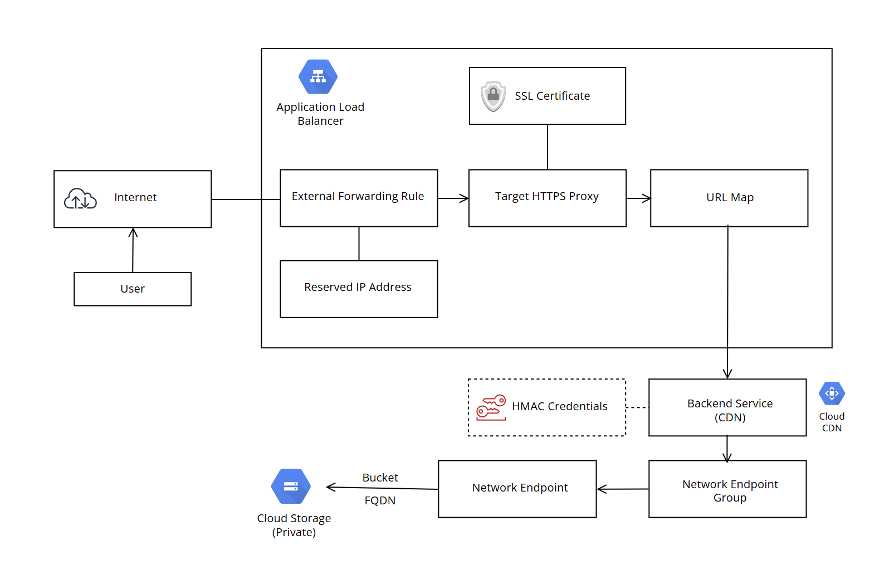

# Demo project


## Description
Provides resources to deploy infrastructure for a static website on Google Cloud using Terraform.

## Infrastructure




## Prerequisites

- ### Create a Google Cloud project:
```bash
  gcloud projects create testwork-9682
```

- ### Select the Google Cloud project that you created:
```bash
  gcloud config set project testwork-9682
```

- ### Enable the Cloud Storage API:
```bash
  gcloud services enable storage.googleapis.com
```

- ### Create a Terraform backend bucket in the Google Cloud:
```bash
gcloud storage buckets create gs://testwork-9682-tfstate --location=EU
```

- ### Clone a git repo:
```bash
git clone https://github.com/localdotcom/testwork-9682.git
```

## Deployment

**NOTE:** Execute all commands under a project's directory using script called `terraform`.

- ### Deploy a private GCS Bucket:
```bash
./terraform plan gcs --project testwork-9682 --region europe-west1
./terraform apply gcs --project testwork-9682 --region europe-west1
```

- ### Deploy IAM Service Account:
```bash
./terraform plan iam --project testwork-9682 --region europe-west1
./terraform apply iam --project testwork-9682 --region europe-west1
```

- ### Deploy Application Load Balancer:
```bash
./terraform plan lb --project testwork-9682 --region europe-west1
./terraform apply lb --project testwork-9682 --region europe-west1
````

- ### Add Google Cloud nameservers to a domain registered with a third-party domain registrar:

  -  Go to **Google Cloud Console > Cloud DNS > Zones**.
  -  Select your DNS zone.
  - Note the four nameservers listed under **NS records** (they'll look something like ns-cloud-a1.googledomains.com, ns-cloud-a2.googledomains.com, etc.).
  - Log into your account at your domain registrar (e.g., GoDaddy, Namecheap, or any other registrar).
  - Go to the **DNS settings** or **Nameserver settings** for your domain
  - Find the section where you can update your nameservers (this is often labeled "Custom Nameservers" or similar)
  - Enter the four GCP nameservers from your DNS zone. Be sure to add all of them.
  - Save or apply the changes.


## Testing

- ### Upload a static content to a newly created private bucket
- ### Open a browser and go to the website's URL. If the site loads as expected, it’s likely working for most users.
- ### Try opening it in an incognito or private window to avoid caching issues.

